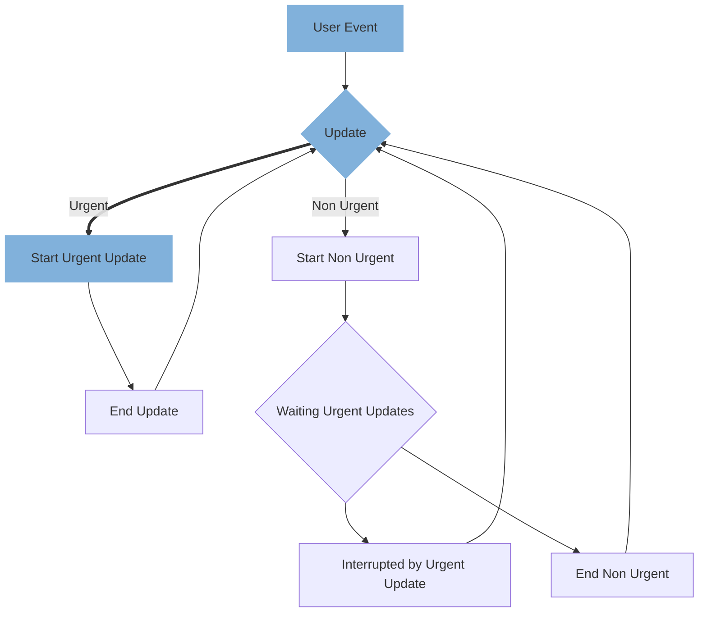

```mermaid  {scale: 0.54}
graph TD
B[User Event] --> C{Update}
C ==>|Urgent| D[Start Urgent Update]
C -->|Non Urgent| E[Start Non Urgent]
D --> G[End Update] --> C
E --> H{Waiting Urgent Updates}
H --> F[Interrupted by Urgent Update]
F --> C
H --> K[End Non Urgent]
K --> C

style B fill:#81B1DB,stroke:#81B1DB,stroke-width:4px
style C fill:#81B1DB,stroke:#81B1DB,stroke-width:4px
style D fill:#81B1DB,stroke:#81B1DB,stroke-width:4px

```

---
src: ./52.5-concurrent-rendering.md
---
